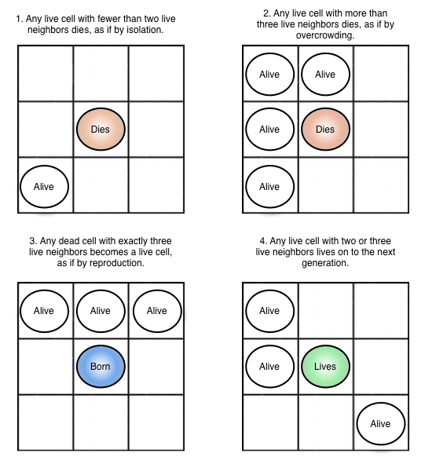

# Conway's Game of Life

## Game of Life
The *Game of Life* is a cellular automaton devised by the British mathematician *John Horton Conway* in 1970.

The game state is an infinite binary board: the game evolution is determined by its current state. One interacts with the Game of Life by creating an initial configuration and observing how it evolves. This game is Turing complete and can simulate a universal constructor or any other Turing machine.

## Rules
Every cell in the board can be alive or dead. At each time step, the new board is computed from the previous one depending on the following rules:

# About this implementation
This repository is a web implementation of the *Game of Life* made in HTML, CSS, and Javascript (using Vue.js).

## Grapical User Interface

## Features
* **infinite editable board**: click to change cell status
* **interactive controls**: start/pause the simulation, single-step, clear the board
* **variable framerate**: choose the animation framerate
* load initial state from **examples list**
* load initial state from configurations encoded in **Run Length Encoding** (RLE)
* **zoom of board:** scroll mouse wheel
* **panning of board**: drag and move mouse
* **different themes**

## Try it!
This implementation is available at: https://fedem96.github.io/GameOfLife

You can find RLE-encoded configurations at: https://www.conwaylife.com/wiki/Main_Page